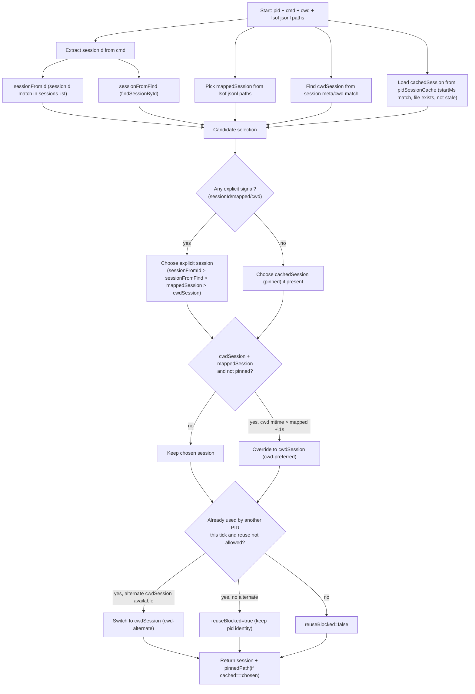

# Codex Session Selection

This document describes how `scanCodexProcesses` (`src/scan.ts`) chooses a Codex session JSONL file for each PID and how pinning prevents mid-run switching.

## Inputs Per PID

During each scan tick, Consensus gathers candidate session information for each Codex process:

- Command line (`proc.cmd`)
  - `sessionId` extracted from `--session <id>` style flags when present.
  - `resume` keyword (enables reuse).
- `lsof`-derived JSONL paths
  - `jsonlByPid[pid]` plus child-process JSONL paths.
  - `mappedSession`: newest JSONL path among those candidates.
- Process cwd
  - `cwdSession`: best match based on cwd and recency (`findSessionByCwd`).
- PID pin cache
  - `pidSessionCache[pid]` contains `{ path, startMs, lastSeenAt }`.
  - `cachedSession`: only used when the cached file still exists and is not stale (`CONSENSUS_CODEX_STALE_FILE_MS`) and the PID start time did not change.

## Decision Tree

## Pinning Semantics

Pinning is a scan-to-scan stability mechanism, not a separate selection source:

- On each tick, once a `sessionPath` is chosen, `pidSessionCache[pid]` is updated with that path.
- On the next tick, the cached session is offered back as `cachedSession`.
- `pinnedPath` is only set when the cached path is the chosen session path. This avoids a stale cached path silently overriding explicit signals.

Pins are released when:

- PID start time changes (PID reuse/restart), or
- cached file is missing, or
- cached file mtime is older than `CONSENSUS_CODEX_STALE_FILE_MS`.

## Identity Stability

Codex agent identity uses stable identifiers to avoid UI flicker:

1. If `reuseBlocked=true` then identity is `pid:<pid>`.
2. Else if `sessionId` exists then identity is `codex:<sessionId>`.
3. Else if `sessionPath` exists then identity is `codex:<sessionPath>`.
4. Else identity is `pid:<pid>`.

This is implemented by `deriveCodexSessionIdentity` (`src/codexSessionAssign.ts`).

